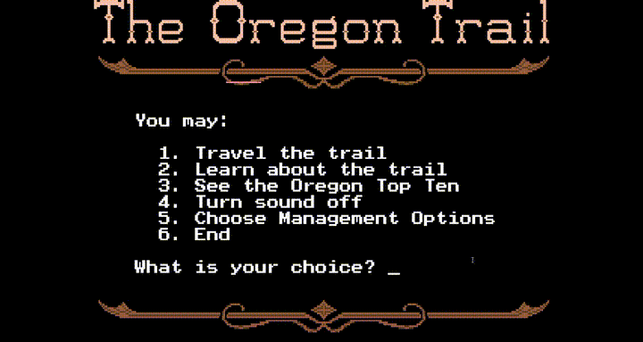

# Oregon Trail Bot
A collection of bots that automate and control gameplay behavior for [The Oregon Trail](https://www.pcjs.org/software/pcx86/game/other/1991/oregon_trail/) video game from 1991.

These bots are written in **Python**, with the **pyautogui module**. This is also **cross-platform**, which means it works for all operating systems (Windows/MacOS/Linux), and it's **open source**, which means that anyone can use my code. 

This project is licensed under the [MIT License](LICENSE.txt).

## Want to Contribute?
See [CONTRIBUTING.md](https://github.com/Mat1020/oregon-trail-bot?tab=contributing-ov-file) for details.

## The Oregon Trail "Gaming Website" Copyright
[pcjs.org](https://www.pcjs.org/software/pcx86/game/other/1991/oregon_trail/#pcjs-machines) © 2012-2025 [Jeff Parsons](https://github.com/jeffpar) <br>
[PCjs](https://github.com/jeffpar/pcjs) is released under an [MIT License](https://www.pcjs.org/LICENSE.txt)

The Oregon Trail video game itself is **open source**, but, however, the link that I include in this repo (that opens up a new window to play it in your web browser) is not own by me, as it's work from another person. This is just a notice to avoid being Copyrighted.

# Start for Speedrunning Bot
An autonomous bot that sets up the start for speedrunning in **under 15 seconds**.
<br>



**Full run:** Download the full [MP4 video](https://github.com/Mat1020/oregon-trail-bot/blob/main/GIFs/start-for-speedrunning.mp4) or watch in [YouTube](https://www.youtube.com/watch?v=k9FTH87C5b8).

> [!WARNING]
> This bot manipulates **keyboard input**. Make sure you **DO NOT** run it on another someplace else.

## Setup
1. Clone This Repository <br>
Open Git and copy & paste this command:

```bash
git clone https://github.com/Mat1020/oregon-trail-bot.git
```

Then, open it with your preferred **code editor/IDE**.


2. Install Python on Your Computer <br>
If you haven't already done so, install the official latest version at [Python.org](https://www.python.org/), choose **your OS**, and follow the downloading instructions.

**Python 3.10** or later is recommended.

3. Install and Activate a Virtual Environment (.venv/) <br>
Within the repository you just cloned, open the terminal and **create your virtual environment**:

```bash
python -m venv .venv
```

***For Windows:*** To activate the virtual environment, you're going to use either the **Command Prompt**, **PowerShell**, or **Git Bash**.

**Command Prompt:** <br>
```bash
.venv\Scripts\Activate.ps1
```

**PowerShell:** <br>
```bash
.venv\Scripts\activate
```

**Git Bash:** <br>
```bash
source .venv/Scripts/activate
```

***For macOS/Linux:*** For macOS or Linux, you're going to activate it using **bash / zsh**. <br>
```bash
source .venv/bin/activate
```

4. Install the Dependencies on requirements.txt <br>
Lastly, on the same terminal, copy & paste this command:

```bash
pip install -r requirements.txt
```

## Running
To run the bot, you need to first open [The Oregon Trail](https://www.pcjs.org/software/pcx86/game/other/1991/oregon_trail/) video game. Then, go under the _Main_ folder and then run _main.py_. Next, boot up the _Start for Speedrunning Bot_. Finally, go back to The Oregon Trail since the bot runs when you **first boot the game**.

### Bot Actions
Essentially, the purpose for _Start for Speedrunning Bot_ is to **initiate your oregon trail in a specific manner for a speedrun**; by establishing everything you need without the need to remember it or to do it yourself at all!

There's more detailed information about what the bot does in the comments from the [code](https://github.com/Mat1020/oregon-trail-bot/blob/main/Main/Bots/start_for_speed_running_bot.py).

### User Actions
After the bot is done with its job, the rest of the speedrun consists:

1. Enter "n" every time you are at a landmark.
2. Spam the space bar: Sometimes you get messages that can slow you down.
3. Near the end, there's a specific part of the trail where you want to:

When you get to choose where to go next, select "1".

When you get to choose where to go next again, select "2".

When you are at "2", select "2" again and enter "y".

You should finish _your_ speedrun afterwards!
